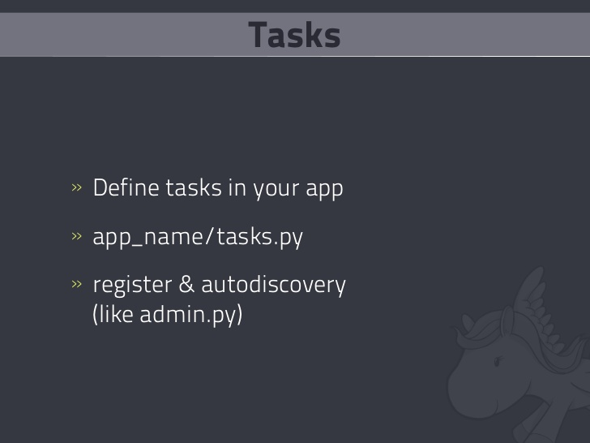
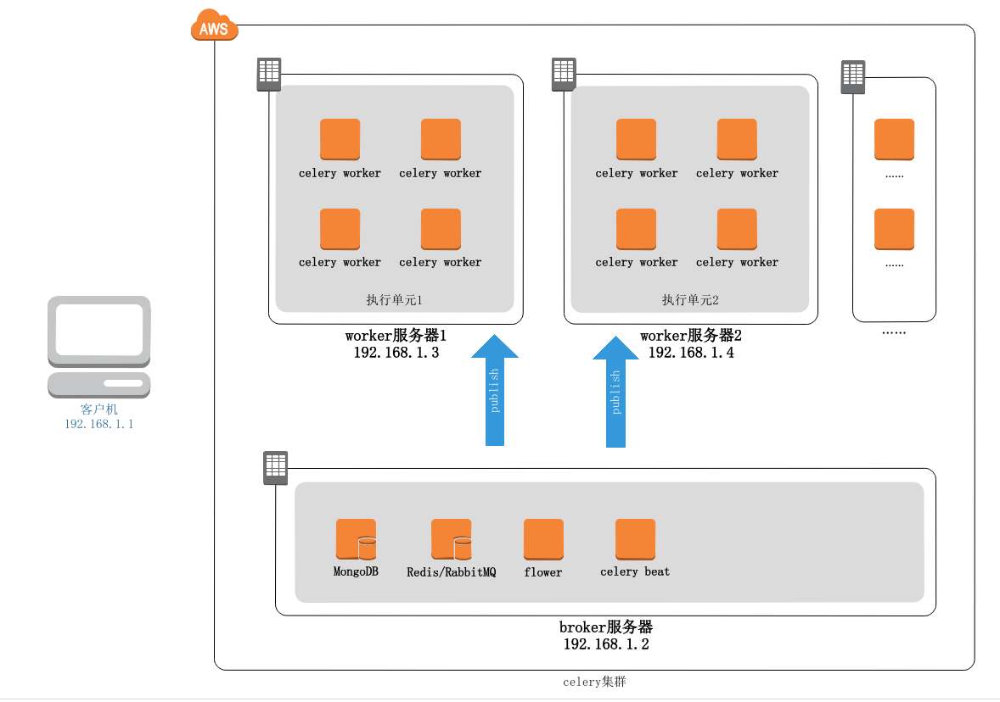

# Celery

# Celery Architecture

1.  celery client发送message给broker

2.  worker 从broker中消费消息，并将结果存储在result_end中

- result 建议使用非关系型数据库

# Use

# Celery colony

- Celery Worker：
  在2 台server上部署worker，其中：
  server1上的worker处理queue priority_low和priority_high上的事件
  server2上的worker只处理priority_high上的事件
- Celery Client：在应用中调用
- Rabbit MQ：在server3上启动
- Redis：在localhost启动

